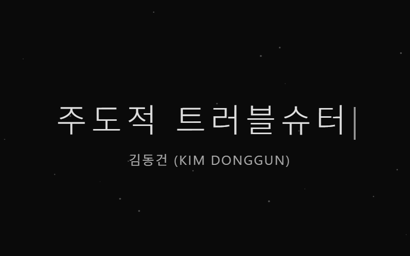

# WhoAmI

**A personal portfolio page built with vanilla HTML, CSS, and JavaScript**

순수 HTML/CSS/JavaScript로 만든 개인 포트폴리오 페이지

[](https://developer.mozilla.org/en-US/docs/Web/HTML)
[](https://developer.mozilla.org/en-US/docs/Web/CSS)
[](https://developer.mozilla.org/en-US/docs/Web/JavaScript)

[**Live Demo**](https://pyrite9.github.io/WhoAmI/)

---

## Preview



---

## Sections | 섹션 구성

| Section            | Description (EN)                          | 설명 (KR)                       |
| ------------------ | ----------------------------------------- | ----------------------------- |
| **Hero**           | Typing headline + fade-in subtitle        | 타이핑 헤드라인 + 부제 페이드인              |
| **About**          | Major and career direction                | 전공 및 진로 방향                     |
| **Skills**         | Languages and infrastructure              | 사용 언어 및 인프라                    |
| **Projects**       | Featured projects (software + experience) | 주요 프로젝트 (소프트웨어 + 실무 경험)         |
| **Experience**     | Naval IT infrastructure operation         | 함정 IT 인프라 운용 경력                |
| **Certifications** | Earned certifications                     | 보유 자격증                        |
| **Footer**         | Contact information                       | 연락처                           |

---

## Implementation | 구현 구조

### Canvas Particle Background | Canvas 파티클 배경

전체 화면 `<canvas>`를 `position: fixed`로 깔고, 80개의 점이 자유 운동하는 배경을 그림. `requestAnimationFrame` 루프로 매 프레임 위치를 갱신하며, 벽에 닿으면 속도 방향을 반전.

```
const dots = [];
const DOT_COUNT = 80;

for (let i = 0; i < DOT_COUNT; i++) {
    dots.push({
        x: Math.random() * canvas.width,
        y: Math.random() * canvas.height,
        vx: (Math.random() - 0.5) * 0.3,
        vy: (Math.random() - 0.5) * 0.3,
        radius: Math.random() * 1.5 + 0.5
    });
}

function drawParticles() {
    ctx.clearRect(0, 0, canvas.width, canvas.height);
    dots.forEach(dot => {
        dot.x += dot.vx;
        dot.y += dot.vy;
        if (dot.x < 0 || dot.x > canvas.width) dot.vx *= -1;
        if (dot.y < 0 || dot.y > canvas.height) dot.vy *= -1;
        // draw circle ...
    });
    requestAnimationFrame(drawParticles);
}
```

**핵심 포인트**

- 각 점은 위치(`x`, `y`), 속도(`vx`, `vy`), 크기(`radius`)만 가진 단순 객체
- 매 프레임 `clearRect`로 전체를 지우고 다시 그림 — 잔상 없는 깔끔한 렌더링
- 화면 리사이즈 시 canvas 크기를 재설정해 풀스크린 유지

---

### Scroll-Triggered Fade-In | 스크롤 트리거 페이드인

각 섹션의 카드는 처음엔 `opacity: 0`, `translateY(30px)` 상태로 숨김. `IntersectionObserver`가 뷰포트 진입을 감지하면 `.visible` 클래스를 부여해 CSS transition으로 부드럽게 등장시킴.

```
const observer = new IntersectionObserver((entries) => {
    entries.forEach(entry => {
        if (entry.isIntersecting) {
            entry.target.classList.add("visible");
        }
    });
}, { threshold: 0.3 });

document.querySelectorAll(".about-info, .skill-card, .project-card, .card, .cert-card")
    .forEach(el => observer.observe(el));

// Stagger delay
document.querySelectorAll(".project-card").forEach((card, i) => {
    card.style.transitionDelay = `${i * 0.15}s`;
});
```

**핵심 포인트**

- **`threshold: 0.3`** — 카드가 30% 이상 보일 때 트리거. 너무 일찍 등장하면 부자연스러움
- **Stagger 효과** — 같은 섹션 내 카드들에 `transitionDelay`를 0.15초씩 누적 부여. 한꺼번에 튀어나오지 않고 순차적으로 등장
- **CSS-driven animation** — JS는 클래스만 토글, 실제 트랜지션은 모두 CSS가 담당. 부드러운 GPU 가속 활용

---

### Typing Effect | 타이핑 효과

Hero 헤드라인은 페이지 로드 시 한 글자씩 타이핑되어 나타남. `setTimeout` 재귀로 매 글자마다 150ms 간격을 두고, 타이핑이 끝나면 부제를 페이드인.

```
const text = "주도적 트러블슈터";
const target = document.getElementById("typing");
let index = 0;

function type() {
    if (index < text.length) {
        target.textContent = text.substring(0, index + 1);
        target.innerHTML += '<span class="cursor">|</span>';
        index++;
        setTimeout(type, 150);
    } else {
        document.querySelector("#hero p").classList.add("show");
    }
}

type();
```

**핵심 포인트**

- **재귀형 `setTimeout`** — `setInterval`보다 안전. 이전 호출이 끝난 후 다음을 예약하므로 누적 호출 위험 없음
- **커서 분리 렌더링** — 매 프레임마다 텍스트를 새로 쓰고 `<span class="cursor">`를 끝에 붙임. 커서는 CSS `@keyframes blink`로 깜빡임
- **시퀀스 제어** — 타이핑이 끝난 시점에서만 부제 등장. 두 요소가 동시에 나오지 않도록 흐름 분리

---

## Tech Stack | 사용한 기술

### Core

- **HTML5** · **CSS3** · **JavaScript (Vanilla)**

### JavaScript

- **DOM Manipulation** — `querySelector`, `textContent`, `innerHTML`, `classList`
- **Canvas API** — 2D context, `requestAnimationFrame`, dynamic resize
- **Intersection Observer** — viewport-aware scroll animation
- **Event Handling** — `setTimeout`, `resize`

### CSS

- **Flexbox** & **Grid** layout
- **Keyframe Animations** — `@keyframes blink` (cursor)
- **Transitions** — `opacity`, `transform`, `scale`, `border-color`
- **Media Queries** — responsive breakpoints (768px, 480px)
- **Custom Properties** — relative units (`rem`, `vw`, `vh`)

---

## Project Structure | 프로젝트 구조

```
WhoAmI/
├── index.html
├── style.css
├── script.js
├── readme-image/
│   └── preview.gif
└── README.md
```

---

## Contact

- Email: <9@g.yju.ac.kr>
- GitHub: [@Pyrite9](https://github.com/Pyrite9)

---

Made by [**Pyrite9**](https://github.com/Pyrite9)
